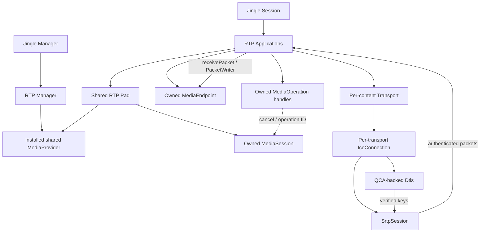
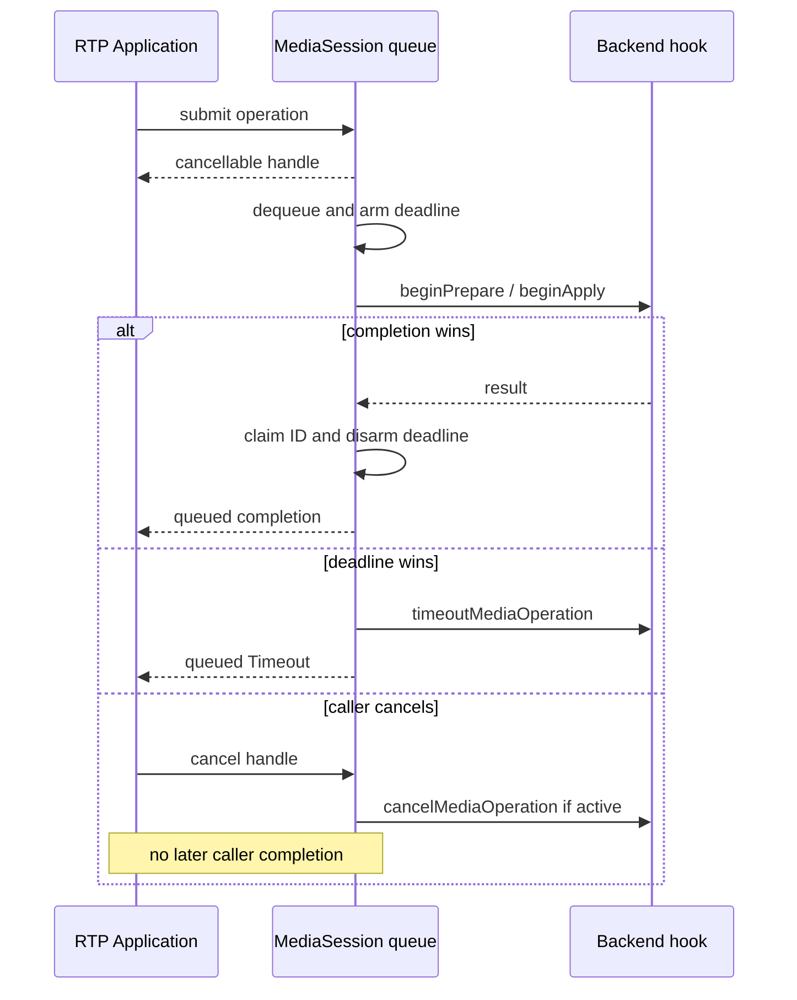
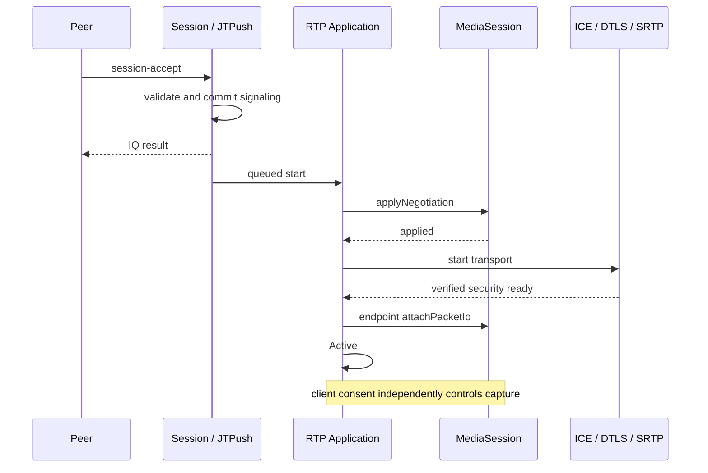
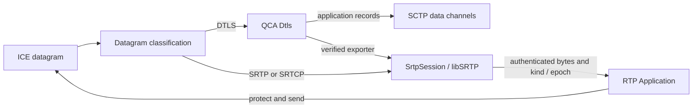

# Native RTP, asynchronous media and DTLS-SRTP

This document describes Iris at commit `36f9e3a`. It is implementation documentation,
not a development roadmap. [Jingle architecture](jingle.md) describes the generic signaling
and file-transfer lifecycle. Media capture, codecs, playback, device policy and RTP generation
remain outside Iris.

## Scope and implementation status

| Layer | Implemented in Iris | Boundary |
| --- | --- | --- |
| RTP signaling | Description, initial offer/answer, prepared answers, session-info, incoming direction/advisory updates | No complete dynamic codec/track renegotiation |
| Media integration | Provider/session/endpoint interfaces, serialized asynchronous operations, cancellation, deadlines | External backend; Iris tests use mock media |
| Transport | Custom `ice:0` and standard `ice-udp:1` wire profiles on the existing ICE implementation | One production network connection per Transport |
| Security | QCA DTLS verification/export and optional libSRTP RTP/SRTCP | No plaintext fallback for packet-capable RTP |
| Grouping | Session grouping snapshots and standalone transactional group/membership models | Models do not drive production shared transport |
| Routing | Standalone authenticated BundleRouter, PT/MID/SSRC validation and shared RTCP result | Not connected to the production RTP Application packet path |
| Interoperability | Synthetic signaling and local UDP/DTLS/SRTP regressions | No live peer call is established by these tests |

Creating or advertising a grouping object does not enable BUNDLE. The ICE Pad does not
automatically advertise a shared connection. JMI and group-coordinated transport recovery
are not supplied by the code described here.

## Object and ownership model

`Jingle::Manager::rtpManager()` owns the RTP application manager. A client installs a shared
`RTP::MediaProvider` and explicitly configures its transport namespace whitelist.
The manager has no enabled RTP transports by default.

Each RTP Pad retains its provider snapshot and owns one `MediaSession`. Each Application owns
a `MediaEndpoint` and operation handles. Applications retain their Pad, so endpoints normally
disappear before the shared media session. Replacing the manager's provider affects new Pads,
not an existing session's backend. Pad destruction calls `cancelAll()` while the derived
media-session implementation still exists.

This is the current production topology, not the proposed shared BUNDLE topology.
The generic byte/datagram `Connection` API used by file transfer is separate from RTP's
`PacketTransport` interface.

## Descriptions and initial negotiation

`jingle-rtp-description.*` models ordered payload types, optional codec attributes, fmtp,
RTCP mux, feedback, header extensions, sources/source groups and retained extension XML.
Parsing a field or preserving unknown XML does not enable the corresponding backend feature.

`Negotiation` stores detached local/remote snapshots and implements an initial per-content
offer/answer exchange. It validates media type, supplied codec metadata, channel count,
payload identity, mux and supported extension offer/answer relationships. Current payload
mapping retains offered PT identifiers; direction-specific codec parameters remain separate.
RTCP-mux descriptions cannot use PT 64–95.

`CodecNegotiator` is the synchronous codec-specific validation boundary. An asynchronous
backend can supply a prepared answer through `MediaSession::prepareAnswer()`; it need not
block in `makeAnswer()`. Iris still validates the returned answer before committing it.
Backend-specific fmtp/codec support must be implemented by the adapter, not inferred from
successful XML parsing.

The Application stores a pending incoming offer until preparation completes. Preparation
failure becomes a content/session negotiation failure. Accepted descriptions alone grant
neither capture consent nor authenticated packet access.

## Media integration

All public media API calls and backend completion invocations occur on the Jingle thread.
Worker-thread engines marshal their results to that thread. No nested event loops, blocking
negotiation or capture side effects are permitted in factories/negotiation.

### Operations

| Public operation | Backend hook | Result |
| --- | --- | --- |
| `prepareLocalOffer(endpoint, callback)` | `beginPrepareLocalOffer` | Prepared local Description or MediaError |
| `prepareAnswer(endpoint, remote, callback)` | `beginPrepareAnswer` | Prepared local answer or MediaError |
| `applyNegotiation(endpoint, local, remote, callback)` | `beginApplyNegotiation` | Success or MediaError |

One MediaSession serializes operations across all its endpoints. Public callbacks are queued:
even a synchronous backend completion does not invoke the caller inline from the public
submission method. Default hooks bridge legacy synchronous endpoint methods; asynchronous
adapters override the hooks.

A returned `MediaOperation` is a cancellable handle; destroying it cancels the operation.
Cancellation suppresses later caller completion. Applications release handles before stopping
their endpoint. Operation state keeps a raw endpoint pointer, so an independent API consumer
must likewise cancel work before destroying that endpoint.

`MediaOperationPolicy` defaults to 15 s preparation, 10 s apply and 8 pending operations,
in addition to the active operation. Policy changes require an idle queue. Invalid submission
or a full pending queue returns no handle. Deadlines start when an operation becomes active,
not when it first enters the pending queue.

The first accepted backend completion claims the operation and disarms its timer; duplicate,
cancelled, stale-ID and timeout-losing completions are ignored. Timeout queues an explicit
`MediaError::Timeout` for the live caller and invokes `timeoutMediaOperation()`.
Its default delegates to cancellation. Backends with untagged completion signals must ensure
that timed-out work cannot be confused with the next request, for example by failing that
backend instance. Iris operation IDs alone cannot identify an external untagged signal.

`MediaSession::runtimeError` is forwarded by the Pad to its applications. Each live application
fails its media path. It is distinct from an operation-specific error. The adapter must define
safe teardown when its underlying backend has already disposed of resources before notifying
Iris; Iris must not assume that a provider's own stop function is idempotent.

### Readiness and packet I/O

Session acceptance is a signaling milestone. The RTP application asynchronously applies the
accepted descriptions; successful apply starts its transport and enters Connecting. Only
configured media plus an authenticated `SrtpSession` permits `attachPacketIo()`. Successful
attachment moves the Application to Active.

The writer is unusable until Active, and carries the security epoch. Incoming and outgoing
RTP are filtered by negotiated PTs and senders; RTCP remains available to receivers.
Retained writers reject traffic after teardown, destruction or security invalidation.
`stop()` must detach endpoint callbacks; adapters own bounded worker queues and independently
enforce local microphone/camera consent.

Security can become ready before apply finishes; the activation gate handles that ordering too.
Signaling-only endpoints do not become Active merely because their transport is ready.

## ICE wire profiles and security

`ICE::Manager` supplies both `urn:xmpp:jingle:transports:ice:0` and
`urn:xmpp:jingle:transports:ice-udp:1`. Namespace-aware Pad creation retains the selected profile;
`jingle-ice-udp.*` validates/serializes the standard XML model and bridges it to the existing
transport implementation. This is not a second ICE agent. `NSTransportsList` selects the
available profile rather than requiring the peer to advertise every manager namespace.

Production `ICE::Pad::connectionFor(Transport*)` maintains a weak transport-to-connection map.
Each Transport has its own reference-counted IceConnection. Some callbacks and signaling state
still depend on that Transport; no live group-sharing registry is used here.

For packet-capable RTP, `PacketTransport::enableRtpMux()` selects the one-component authenticated
RTP/RTCP path. The answer must accept rtcp-mux; an incompatible answer does not enable raw RTP.
`RTP::supportedSecureRtpProfiles()` probes the intersection usable by the SRTP packet engine
and QCA DTLS. This indicates crypto availability, not codecs, device availability or interop.

QCA3 negotiates DTLS profiles and exports directional keys/salts after fingerprint verification.
`Dtls` gates application data and key access on authentication and invalidates them on errors,
closure or fingerprint changes. Fingerprints conveyed by signaling do not independently provide
OMEMO-authenticated peer identity.

Optional `IRIS_ENABLE_SRTP` links libSRTP's public packet API. `SrtpContext` owns separate
send/receive contexts, replay state and key copies. AES-CM/HMAC-SHA1 and AEAD-GCM depend on the
installed backend's supported profiles; null encryption is rejected. Reapplying identical live
keys preserves replay state. Failed reconfiguration invalidates the context.

`SrtpSession` binds these contexts to one Dtls association, listens for invalidation and checks
the authentication gate at packet access, including reentrant access during invalidation.
An epoch is scoped to that binding, not a global generation. Independently retained key copies
cannot be erased by invalidating the binding.

STUN/TURN handling belongs to the lower network layer. Media does not travel as DTLS application
records. No custom QCA cipher backend is registered in libSRTP; its system backend and QCA DTLS
coexist. SRTP unavailability must not be equated with plain DTLS/SCTP unavailability.

## Group and routing components

These are implemented private components, **not production shared-transport wiring**:

| Component | Current responsibility |
| --- | --- |
| Session grouping snapshots | Ordered proposals and validated initial peer grouping |
| `GroupNegotiation::initialPlan()` | Pure initial association plan from members, groups and optional transport snapshots |
| `GroupPlan::readyToCommit()` | Distinguishes preflight from a plan with required transport parameters |
| `ConnectionRegistry` / `ConnectionMembership` | Association identity and explicit member lifetime |
| `ConnectionGroupTransaction` | Acquires owner/member handles transactionally; releases acquired handles on failure |
| `BundleRouter` | Routes already authenticated packets against an explicit route table |

Group planning checks content identity, sharing support, namespaces and supplied transport
parameter compatibility. These checks must not be mistaken for production Session committing
network groups: current Session grouping validation and ICE connection allocation are separate.
ICE generation, security epoch and route revision are distinct state.

BundleRouter uses MID, then known incoming SSRC, then globally unique PT fallback. The selected
content must allow the PT. It validates RTP header/CSRC/extension/padding bounds. Learning and
configured source counts are bounded; local and incoming SSRC tables serve different directions.

Outgoing SSRC registration records actual producer identity independently of static declarations.
A successful registration survives reconfiguration of the same content even if its static SSRC
is removed. Runtime unregister does not remove a still-declared static source. Reconfiguration
is transactional and discards registrations belonging to removed contents.

RTCP routing inspects known sender/report/media SSRC fields. A single matched route returns
`Delivery::Content`; multiple routes return one `Delivery::SharedRtcp` with related contents.
It neither splits nor broadcasts the packet. Unknown or malformed routing input is rejected.
Support for a packet-type case is not exhaustive parsing of every feedback FCI or XR report
block. Consumers need an explicit policy for those additional source references.

No production Application currently consumes SharedRtcp or gets a per-content channel from a
shared association. A client cannot turn this into working BUNDLE simply by setting groups.
The existing single-transport stop path also cannot serve as shared-member release.

## Signaling and runtime capabilities

RTP Pad parses ringing, active, hold/unhold and mute/unmute notifications, validating a batch
before notifying consumers. These notifications do not change capture permission.
Incoming content-modify updates senders for applications that opt in. The RTP packet gate
observes senders; backend capture/direction policy remains an external integration concern.
Description-info is advisory, not an arbitrary replacement offer.

DTLS fingerprint/setup negotiation is carried in transport descriptions. A generic
security-info handler is not a prerequisite for that path. Transport replacement for an RTP
application is currently disabled from Connecting onward; coordinated group restart/rekey
is not implemented.

RTP Manager discovery uses the installed provider's `mediaTypes()`. Iris does not prove that
those claimed media types are usable codecs. Installing a provider and selecting transport
namespaces are separate configuration steps. The client owns capability probing, consistent
discovery/caps updates and user-facing availability policy.

## Verification and present limits

The standalone `tests/jingle` project includes XML/profile selection, group plan/commit,
ownership, RTP negotiation/prepared answers, media operations, application/runtime errors,
subset acceptance, routing, SRTP and transport ACK regressions.

With system QCA3 and SRTP enabled it also includes loopback ICE/SRTP and mock-media packet
tests in both ICE wire profiles. DTLS tests cover verified keys and, when SCTP is enabled,
DTLS application data/data channels alongside SRTP contexts. These tests do not validate
NAT/TURN deployment, actual encoded media, BUNDLE runtime or Conversations.

Read [interop status](jingle-calls-interop.md) for test scope/results and
[the implementation plan](jingle-calls-implementation-plan.md) for remaining work.
Acceptance scheduling and callback lifetime rules are documented in [the session lifecycle](jingle.md#session-state-versus-connectivity).

## Source map

Paths below are relative to `src/xmpp/xmpp-im` unless stated otherwise.

- `jingle-rtp.{h,cpp}`: Manager, Pad, Application and public media interfaces.
- `jingle-rtp-media.cpp`: serialized operations and deadlines.
- `jingle-rtp-description.*`, `jingle-rtp-negotiation.*`, `jingle-rtp-info.*`: XML and negotiation.
- `jingle-rtp-srtp.*`: PacketTransport, capability probe and SRTP binding.
- `jingle-rtp-router_p.*`: standalone authenticated router.
- `jingle-group-negotiation_p.h`, `jingle-ice-group_p.h`: group planning/commit model.
- `jingle-ice-connection_p.h`, `jingle-ice.*`: resources and production transport.
- `jingle-ice-udp.*`: standard transport wire codec.
- `src/irisnet/noncore/dtls.*`: QCA wrapper and authentication gate.

Protocol references: [XEP-0167](https://xmpp.org/extensions/xep-0167.html),
[XEP-0176](https://xmpp.org/extensions/xep-0176.html),
[XEP-0320](https://xmpp.org/extensions/xep-0320.html),
[XEP-0338](https://xmpp.org/extensions/xep-0338.html),
[RFC 5761](https://www.rfc-editor.org/rfc/rfc5761),
[RFC 5764](https://www.rfc-editor.org/rfc/rfc5764) and
[RFC 7983](https://www.rfc-editor.org/rfc/rfc7983).
