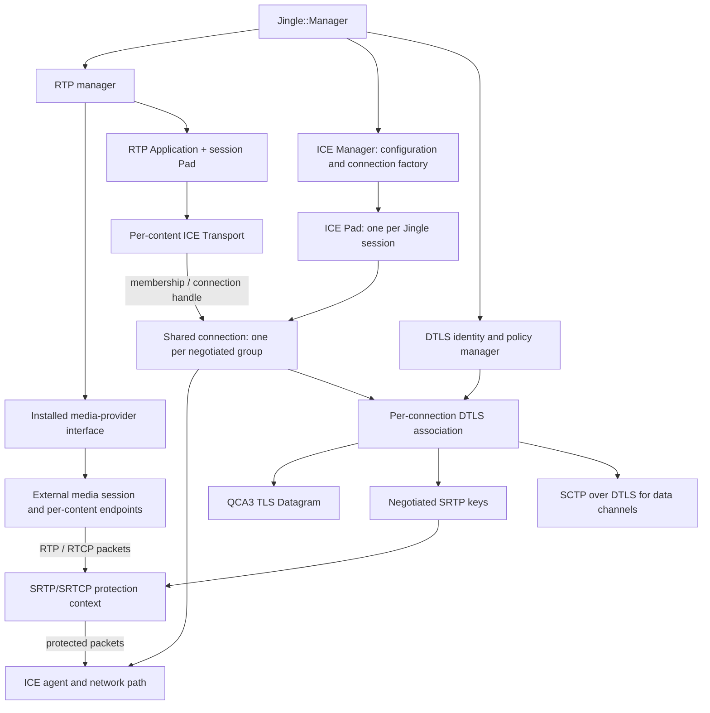
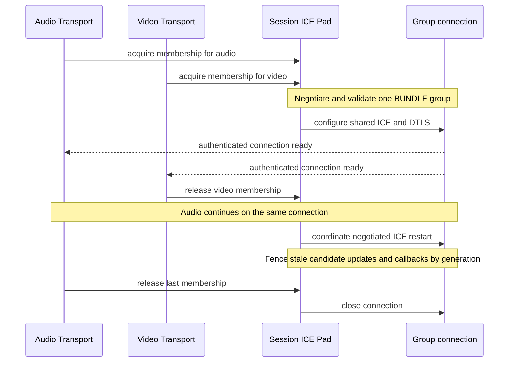
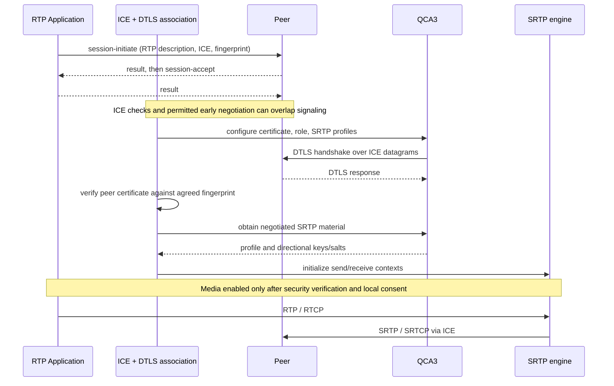

# RTP and DTLS extension design

This describes implemented signaling foundations and the remaining native RTP extension boundary.
It is not a complete native calling stack.
Media capture, codecs, playback and RTP packet generation remain outside Iris.

## Existing foundation

Iris provides application/transport managers, ICE, a QCA-backed `Dtls` wrapper and SCTP data
channels. `Jingle::Manager` owns an RTP application manager, accessible through `rtpManager()`.
It advertises no RTP capabilities and has no enabled transports by default.
`RTP::Description` provides the standalone RTP XML model: ordered payloads, optional codec
attributes, format parameters, SSRC, RTCP multiplexing and preserved extension elements.
Advisory parsing keeps omitted codec attributes absent. Extensions are preserved, not
automatically supported or accepted; this model does not itself perform codec negotiation.
`RTP::Negotiation` implements one initial per-content offer/answer exchange independently of
Session/Application state. It validates descriptions, media type, matching supplied codec metadata,
channel counts and RTCP-mux answers before committing detached local/remote snapshots.
Descriptions offering RTCP mux cannot use RTP payload types 64–95, which collide with
RTCP demultiplexing when the marker bit is set ([RFC 5761 section 4](https://www.rfc-editor.org/rfc/rfc5761.html#section-4)).
Its current policy requires offered payload IDs to be retained; this follows the recommended path
in [XEP-0167 section 5](https://xmpp.org/extensions/xep-0167.html#negotiation), not every possible
payload remapping permitted by that specification. Supporting remapping requires directional maps.
Answer codec order is preserved, and the two descriptions retain independent SSRCs and parameters.
`CodecNegotiator` is the synchronous per-content adapter contract: it generates a local answer or
validates a remote one, including codec-specific fmtp, omitted/static codec metadata, RTX dependencies
and extension semantics. There is no default permissive implementation. The adapter must not retain
references to call arguments, enter nested event loops, enable capture or perform network I/O.
An adapter failure leaves the previous negotiation state intact. Unknown XML extensions remaining
in a parsed description are not a capability advertisement or proof that they are negotiated.
The native RTP Application uses this component and is tested with a mock adapter, not psimedia.
Its `Accepted` state means description negotiation only, not user consent or authenticated media readiness.

ICE network resources are held by an internal reference-counted `IceConnection`, with one
owner per Transport at present. The session's ICE Pad keeps a weak transport-to-connection
registry; it neither prolongs a connection's lifetime nor shares connections by peer JID.
ICE/DTLS/SCTP packet forwarding callbacks are scoped to the connection. Signaling, discovery
and incoming-channel acceptance still depend on the individual Transport; negotiated group
membership and bundled media routing are not implemented. The ICE Pad does not automatically
announce BUNDLE for independent connections.
`Session::setGroupings()` stores an ordered list of local proposals, including multiple groups
with the same semantics. `remoteGroupings()` stores grouping from a successfully parsed initial
peer offer/answer separately. Parsing validates group structure and duplicate members. Groups
with unresolved or ambiguous content references are ignored as a whole; references resolve
against that offer/answer, not an older session snapshot. Empty groups are representable in
the generic framework ([RFC 5888, sections 5–6](https://www.rfc-editor.org/rfc/rfc5888.html#section-5)).
For an incoming initial answer, BUNDLE membership is checked against a snapshot of the groups
actually sent in `session-initiate`, not the mutable local proposal. New members, merging or
splitting offered groups and repeated memberships are rejected before application processing;
omitting a group or accepting a subset is allowed at this layer
([RFC 9143, sections 7.3–7.4](https://www.rfc-editor.org/rfc/rfc9143.html#section-7.3)).
This does not validate bundle-only restrictions, tagged-content selection or ICE/DTLS/RTP
compatibility. Local setters reject overlapping BUNDLE memberships and unoffered initial
answer memberships. Immediately after pad `onSend()` hooks, initial outgoing grouping is
revalidated against live contents and the peer offer, before application updates are consumed.
Invalid outgoing grouping terminates negotiation instead of sending an invalid offer/answer. These
snapshots are not a live connection-membership map and do not enable shared ICE by themselves.
The ICE transport advertises `urn:xmpp:jingle:transports:ice:0`; interoperable RTP needs a review
of the wire format against [XEP-0176](https://xmpp.org/extensions/xep-0176.html), including the
standard `ice-udp:1` namespace. Renaming the namespace alone is not a conformance implementation.

The local QCA3 API already exposes `supportedSRTPProfiles()`, `setSRTPProfiles()`,
`selectedSRTPProfile()` and `srtpKeyingMaterial()` on `QCA::TLS`. The returned material contains
separate local/remote master keys and salts. QCA does not implement SRTP packet processing.
Iris's `Dtls` wrapper exposes profile configuration and, with QCA3, the keying material.
Nonempty configured profiles require SRTP negotiation; failure to select one fails the
connection. Keys are exposed only after fingerprint verification and become unavailable on
error, close or fingerprint change. Plain DTLS remains available with an empty profile list.
Application datagram reads/writes are gated by the same authenticated state. `RTP::SrtpSession`
binds packet protection to one DTLS association: it initializes from verified key material and
discards its contexts on `needRestart`, `errorOccurred`, `closed` or DTLS destruction.
Invalidation cannot erase copies of key material retained independently by other callers.

## Responsibilities

The shared security manager should supply local identities/certificates, peer verification policy
and factories for DTLS associations. It must not cache one live handshake or one set of traffic
keys per JID: concurrent contents, separate calls, transport replacements and connection restarts
need independently scoped state. Any future association reuse needs explicit negotiated rules.
Peer identity policy must distinguish an authenticated fingerprint binding from a fingerprint
merely delivered by the signaling channel.

An association owns its expected fingerprint, DTLS role, handshake and key lifecycle. Connectivity
comes from ICE; certificate/role signaling belongs to the Jingle transport representation. The
same association abstraction can serve data channels and RTP while their packet paths differ:
SCTP uses DTLS application data; RTP uses SRTP/SRTCP with DTLS-derived keys. RTP is not wrapped in
DTLS application records. Packet classification must route STUN, DTLS and protected media to
their respective handlers; see [RFC 7983](https://www.rfc-editor.org/rfc/rfc7983).

## Shared ICE connections and BUNDLE

The proposed split keeps content negotiation separate from connectivity:

- **ICE Manager** supplies configuration, STUN/TURN services and connection factories. Peer
  information can inform policy, but a peer JID is not a connection-sharing key.
- **ICE Pad**, scoped to a Jingle session, coordinates negotiated groups and maps content
  identities to connection memberships. It is the session-level authority for these mappings.
- **Shared connection** owns the ICE agent, candidates, selected path, DTLS association and
  connection-generation state for a negotiated group. An unbundled content gets its own
  connection. Separate sessions to the same peer remain independent.
- **Per-content Transport** remains the application's Jingle transport representation. It
  validates/serializes transport parameters and holds a membership handle; it does not own an
  independent ICE agent when bundled. Acquiring a handle does not imply readiness: negotiation,
  connectivity and authenticated packet delivery have distinct asynchronous states.

This is not sharing a single `Transport` object between applications. Per-content stop/removal
must release only that membership; other group members continue using the connection. The last
membership closes the connection, and session shutdown closes all its connections. Applications
must not independently restart or reconfigure a shared agent.

Group negotiation must be explicit in both incoming and outgoing signaling. The representation
needs ordered members and the negotiated transport owner, and must allow multiple groups with
the same semantics. Advertising or emitting a BUNDLE group is not sufficient: shared transport
parameters must be reconciled, and incompatible group answers must be rejected or handled by a
defined fallback before starting media. The grouping framework is described by
[XEP-0338](https://xmpp.org/extensions/xep-0338.html); wire-level BUNDLE negotiation and packet
demultiplexing need their own implementation and interoperability tests.

The shared connection classifies incoming packets; the RTP layer above it owns SRTP/SRTCP
protection and media routing across the group's contents. That routing must use negotiated
MID/SSRC and payload-type mappings rather than assuming one raw ICE channel per content.
RTP/RTCP multiplexing and BUNDLE are separate negotiated properties. A psimedia adapter can
therefore expose audio and video endpoints backed by one media session without owning ICE.

ICE restart is coordinated once for the group. Candidate updates and asynchronous callbacks
must be associated with the correct generation so that stale work cannot affect a replacement
connection. ICE generation and DTLS association lifetime are distinct: whether DTLS can be
retained is a protocol/policy decision, not an automatic consequence of retaining the group.
When security is invalidated, protected media stops until fresh authenticated contexts are ready.
Removing the group's transport-owning content requires an explicit ownership transition or
renegotiation, not accidental destruction of the shared network path.

## Media integration

`jingleManager()->rtpManager()->setMediaProvider()` accepts a shared media-provider implementation.
Each RTP Pad retains that provider and owns one media session; applications own per-content endpoints.
Replacing the provider affects new sessions, not existing endpoints. Endpoint destruction and `stop()`
must quiesce worker callbacks synchronously; calls into the interface run on the Jingle thread.
The synchronous interface negotiates descriptions and configures endpoints without starting capture
or network I/O. An asynchronous engine needs prepared capabilities, not nested event loops.
The psimedia adapter remains to be added. Signaling-only endpoints stay `Connecting`.
Endpoints opting in through `supportsPacketIo()` receive a `PacketWriter` in `attachPacketIo()`
only after configuration and DTLS authentication. Successful attachment makes the Application
`Active`; the writer rejects calls before that transition. This does not grant capture consent.
Authenticated packets arrive through `receivePacket()`. The Application enforces negotiated
payload types, RTP senders and the security epoch in both directions; RTCP remains available
to receivers. Retained writers cannot send after teardown or security invalidation. Adapter
calls and writers stay on the Jingle thread; worker-thread engines must provide bounded queues
and detach callbacks in `stop()`. `PacketTransport` is the abstract transport boundary, implemented
by ICE: the RTP Application does not depend on the concrete ICE class. This initial packet path
requires RTCP mux and rejects an answer declining it instead of falling back to plaintext.
Device selection, encoding, decoding
and the user's media consent stay with the client/media engine.

The interface needs explicit ownership, shutdown and thread-affinity rules. In particular,
real-time media callbacks should not directly call arbitrary Jingle objects across threads;
packet queues must be bounded. Negotiating a sending direction must not by itself enable a
microphone or camera without local consent.

## Signaling and encryption

[XEP-0167](https://xmpp.org/extensions/xep-0167.html) defines RTP descriptions and advisory
`description-info` updates. These updates can contain only modified parameters; they are not
complete replacement offers. The RTP pad handles application-specific `session-info`
including ringing, hold and mute, validates the whole batch before emitting notifications, and
checks named content references. Peer notifications do not change local capture consent.
The generic incoming `content-modify` handler controls
the content's senders for applications opting in through `supportsContentModify()`. A native RTP
application must connect `sendersChanged()` to its media endpoint while retaining independent
local capture consent. Outgoing direction-change signaling and that endpoint are not implemented yet.

[XEP-0320](https://xmpp.org/extensions/xep-0320.html) carries DTLS fingerprints and setup roles
inside the transport, in initial negotiation or `transport-info`. `security-info` is not a
prerequisite for this DTLS-SRTP flow. Only a concrete security-precondition protocol would
justify an implementation of that separate action. The fingerprint mechanism also applies to
SCTP/DTLS data channels described by [XEP-0343](https://xmpp.org/extensions/xep-0343.html).

## SRTP library boundary

Use an established SRTP implementation for packet protection, replay windows and rollover
counters. QCA3 can perform DTLS negotiation and key export regardless of which crypto backend
the SRTP implementation uses internally.

libSRTP 2.6.0's [crypto kernel header](https://github.com/cisco/libsrtp/blob/v2.6.0/crypto/include/crypto_kernel.h)
exposes cipher/auth registration interfaces. They make a QCA adapter conceivable, but are a
source-level crypto-kernel interface, not a ready-made QCA integration. The kernel is global;
backend registration must be coordinated once per process. A production adapter needs a pinned
API, matching key derivation/profile semantics, known-answer tests and packet-path benchmarks.
The optional `IRIS_ENABLE_SRTP` build option links system libSRTP through its public packet API.
`RTP::SrtpContext` owns separate send/receive contexts, replay windows and key copies; it supports
AES-CM/HMAC-SHA1 and AEAD-GCM profiles when the installed backend accepts them. It rejects null
encryption, invalid key sizes, failed authentication, replay and excessive SSRC creation. Reapplying
identical active keys preserves replay state; failed reconfiguration invalidates the context.
The lower-level context's owner must reset it when authentication is invalidated. `SrtpSession`
automates this for a DTLS association and also checks the DTLS authentication gate at packet access,
including reentrant calls before its invalidation signal handler runs. Attaching before the handshake
or after authentication is supported; plain DTLS does not activate SRTP. Its `epoch()` must accompany
queued packets, and stale epochs are rejected. Queue owners must flush pending media on `invalidated()`.
Epoch numbers are scoped to the binding object, not global identifiers. Use one binding per association;
do not create parallel packet contexts with the same keys and SSRCs. All access must stay on the DTLS
thread. `close()` permanently detaches a binding without shutting down the DTLS association,
so stopping an RTP consumer does not itself close a coexisting SCTP association.

ICE's explicit experimental `enableRtpMux()` mode creates the binding before DTLS negotiation,
using the intersection of QCA and libSRTP profiles. It supports one RTP/RTCP-mux component only;
the caller must enforce mux acceptance in the RTP answer. It rejects raw media channels and
has no plaintext fallback. `sendRtpPacket()` protects packets before ICE writes; incoming ICE
payloads are dispatched through `SrtpSession::dispatchMuxed()`. Classification follows
[RFC 7983](https://www.rfc-editor.org/rfc/rfc7983.html#section-7): DTLS records go to QCA, SRTP/SRTCP
to libSRTP, and unsupported payloads are dropped. STUN/TURN encapsulation belongs to the lower ICE
layer, not this media dispatcher. Authenticated media is emitted with its packet kind and epoch.
RTP payload-to-content/SSRC routing, media queues and BUNDLE membership are separate, unfinished layers.
Transport stop/failure closes the binding; final ICE-connection teardown destroys it before DTLS.
The RTP Application selects this mode for packet-capable endpoints only. It does not change discovery.

`jingle_icertp` exercises two native ICE transports on UDP loopback, their XML transport
updates, QCA DTLS handshake, RTP delivery and reverse RTCP delivery. It holds a failed
fingerprint acknowledgement while ICE is connected and verifies that SRTP remains unavailable;
a successful acknowledgement then permits the handshake. Stopping the transport disables media.
The test requires permission to bind local UDP sockets and is enabled with system QCA3 and SRTP.
It does not exercise NAT, TURN, BUNDLE, a media engine or a remote XMPP client. An explicit
`ICE::Manager::setSelfAddress()` restricts candidate gathering to that address; otherwise available
network addresses are used.
`jingle_rtpmedia` runs the same local network path through two RTP Applications with mock
media endpoints. It additionally checks single attachment, the Active transition, backend
RTP/RTCP delivery, senders/payload filtering in both directions and rejection of retained writers
after stop and Application destruction. Incoming filter probes are first observed at the
authenticated SRTP boundary, so a packet lost before decryption cannot masquerade as a successful
filtering test. Unit regressions also exercise cancellation during the Connecting signal and
Application deletion from transport stop callbacks.

No custom QCA cipher backend is registered in libSRTP. Its system backend (for example NSS)
protects RTP/RTCP, while QCA continues to perform DTLS and authenticated SRTP key export.
SCTP data channels use DTLS application records and do not pass through libSRTP.

## Implementation milestones

Verification covers signaling, DTLS-SRTP key export, ICE resource ownership, native RTP application
negotiation with a mock provider and SRTP packet protection in `tests/jingle`. No native RTP call,
psimedia adapter or Psi/Conversations interoperability has been verified yet. Enabling feature
advertisements must wait for the corresponding implementation, not just XML support.

1. Introduce the session-scoped connection/membership boundary and group negotiation model,
   preserving independent connections for existing unbundled applications. Test two members,
   removal of one member, final teardown, restart and isolation between sessions to the same peer.
2. Add RTP descriptions, an application/session Pad and a mock media provider. Exercise audio
   and video signaling together, BUNDLE acceptance/refusal and RTP/RTCP multiplexing. An
   audio-only call is the one-member case, not a separate architecture to retrofit later.
3. Connect standard ICE-UDP, QCA3 DTLS-SRTP and an SRTP engine. Test fingerprint mismatch,
   packet replay, bundled media demultiplexing, restart and transport replacement.
4. Add the psimedia adapter outside Iris and verify Psi/Conversations interoperability before
   enabling the native call path in Psi.
