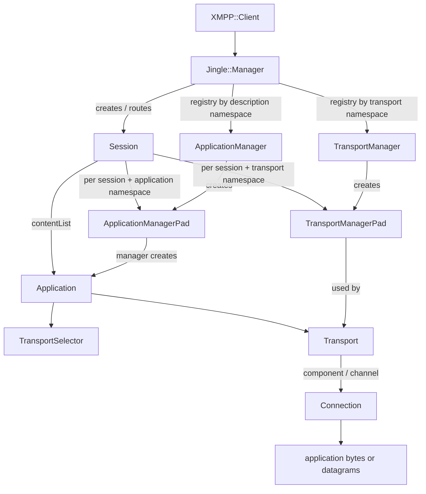
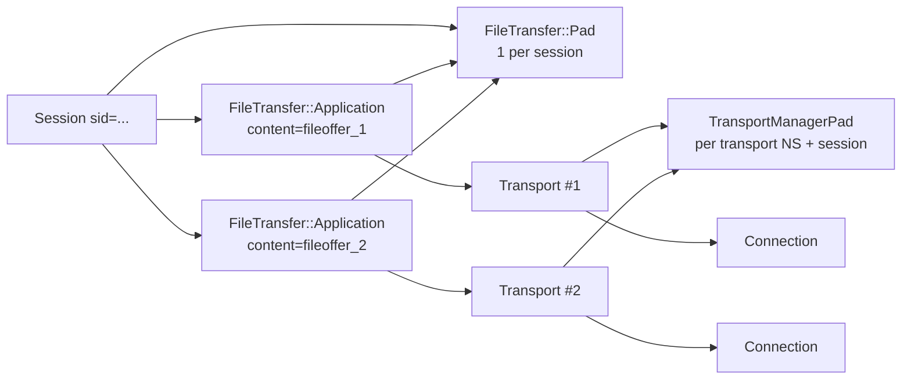
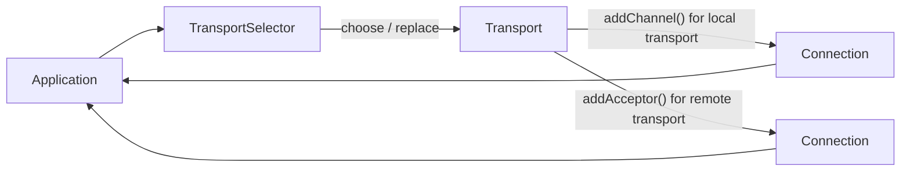
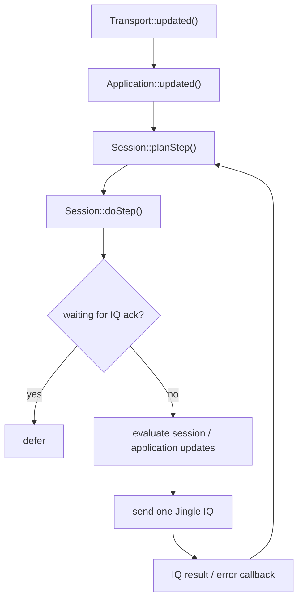
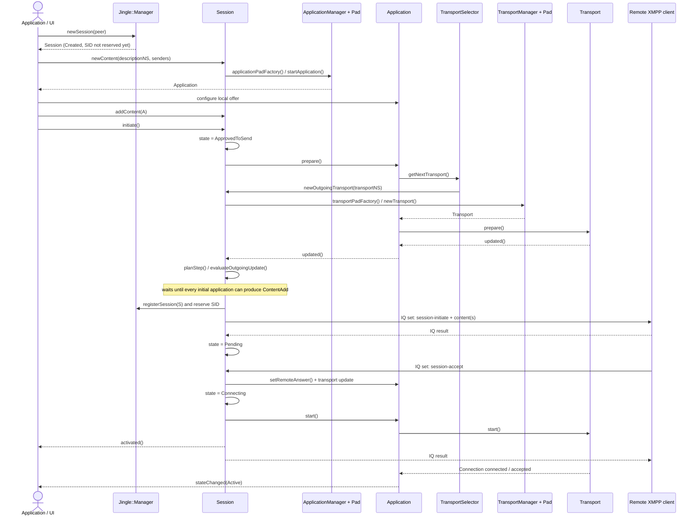
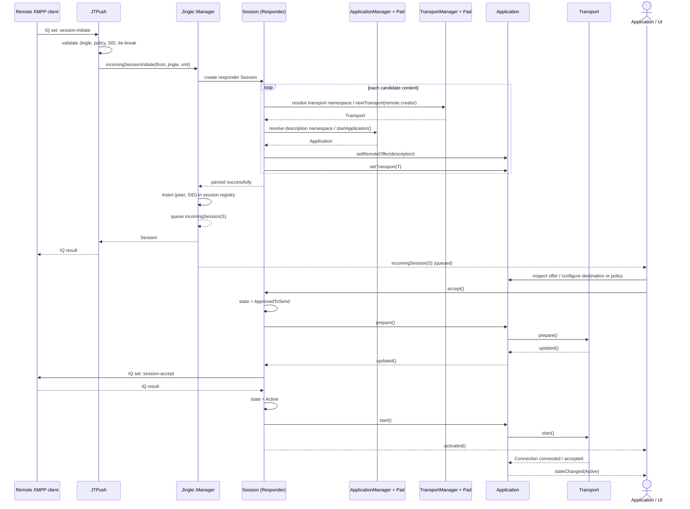
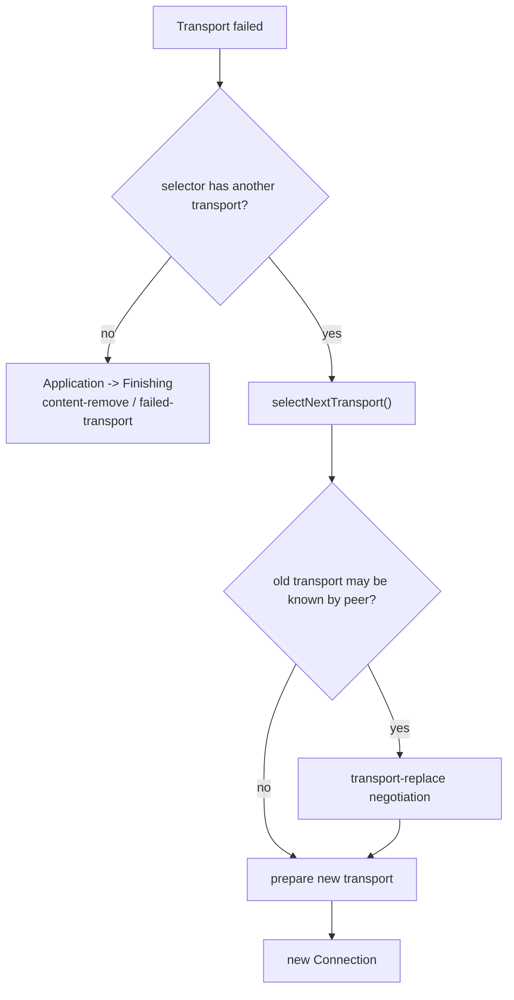

# Jingle architecture and lifecycle

This document describes the current Jingle implementation in Iris. It assumes familiarity with
XMPP and the concepts from XEP-0166 (sessions, contents, descriptions, transports and Jingle
actions), but not with the Iris source tree.

The implementation is intentionally split into two planes:

- **signaling** — `Manager`, `Session`, application/transport managers and pads turn Jingle IQs into
  object updates and serialize local updates back to `<jingle/>`;
- **data** — an `Application` selects a `Transport`, and the transport exposes one or more
  `Connection` objects used by the application to move bytes or datagrams.

For the native Iris stack, the relevant entry point is `XMPP::Client::jingleManager()`.
`XMPP::Client` currently creates the Jingle manager, registers the built-in file-transfer
application, and registers S5B, IBB and ICE transport managers.

> **Scope:** Psi also has an external RTP Jingle implementation. It registers the RTP description
> namespace with `Manager::addExternalManager()`, which tells the Iris Jingle task not to consume
> those sessions. The architecture below describes sessions handled by the native Iris Jingle
> stack.

## From XEP-0166 concepts to Iris objects

| XMPP/Jingle concept | Iris object | Lifetime / responsibility |
| --- | --- | --- |
| Jingle engine for one XMPP client | `Jingle::Manager` | Registry for application and transport managers, incoming IQ routing, session lookup by peer/SID, disco features. |
| One Jingle `sid` | `Jingle::Session` | Owns the signaling lifecycle and the set of `<content/>` applications. |
| `<description xmlns='...'>` implementation | `ApplicationManager` + `Application` | The manager is global for an application namespace; each `Application` represents one `<content/>`. |
| Per-session application state | `ApplicationManagerPad` | Adapter shared by applications of the same description namespace in one session; also handles application-specific `session-info`. |
| `<transport xmlns='...'>` implementation | `TransportManager` + `Transport` | The manager is global for a transport namespace; a `Transport` is attached to an application and performs one transport negotiation. |
| Per-session transport state | `TransportManagerPad` | Adapter shared by transports of the same transport namespace in one session. |
| Transport selection/fallback | `TransportSelector` | Owned by an application. Chooses an initial transport and later replacements. |
| Actual application data path | `Connection` | Minimal byte/datagram transfer unit exposed by a transport; shared between the transport and application. |

The most important distinction is that a **pad is not a content and is not a transport**. A pad is
a per-`Session`, per-namespace bridge to a global manager. For example, a session containing three
file-transfer contents normally has three `FileTransfer::Application` objects but only one
`FileTransfer::Pad`.

## Object structure



The same relationships shown as a concrete multi-file session are useful for understanding pad
sharing:



### Managers and registration

`Jingle::Manager` is owned by `XMPP::Client`. Application and transport implementations register
one or more namespaces:

```cpp
jingleManager->registerApplication(applicationManager);
jingleManager->registerTransport(transportManager);
```

A manager is global to the client, while its `pad(Session *)` factory creates the object that binds
that implementation to one session. `Session::applicationPadFactory()` and
`Session::transportPadFactory()` cache these pads by namespace. The cache holds weak pointers;
applications/transports keep the pad alive while they use it.

When an incoming `<content/>` is parsed, the description namespace selects an
`ApplicationManager`, and the transport namespace independently selects a `TransportManager`.
Unsupported description or transport namespaces therefore fail at well-defined points before the
session is exposed to the application UI.

### Application and transport are separate layers

An `Application` is the Iris representation of one Jingle `<content/>`. It owns application-level
state such as the content name, creator, senders, description offer/answer, current transport and
transport selector.

A `Transport` owns connectivity state and signaling for one transport negotiation. It does not
interpret the application description or move file/media semantics itself. Instead it exposes
`Connection` objects with the requested `TransportFeatures`.

For the built-in file-transfer application, the required transport features are:

```cpp
TransportFeature::Reliable | TransportFeature::Ordered | TransportFeature::DataOriented
```

`FileTransfer::Application::prepareTransport()` then waits for a single matching `Connection`.
For a locally-created transport it requests a channel with `Transport::addChannel()`. For a
remote-created transport it installs a connection acceptor and waits for the transport to deliver
a matching incoming connection.



`Connection` derives from `ByteStream`, but also has datagram APIs. The negotiated
`TransportFeatures` tell an application whether to use stream reads/writes or message-oriented
`readDatagram()` / `writeDatagram()`.

## Built-in native Jingle pieces

At client construction time Iris registers the file-transfer application and three transport
managers:

| Implementation | Namespace | Relevant manager features |
| --- | --- | --- |
| File transfer | `urn:xmpp:jingle:apps:file-transfer:5` | Requires a reliable, ordered, data-oriented transport. |
| S5B | `urn:xmpp:jingle:transports:s5b:1` | `Reliable`, `Ordered`, `Fast`, `DataOriented`. |
| IBB | `urn:xmpp:jingle:transports:ibb:1` | `AlwaysConnect`, `Reliable`, `Ordered`, `DataOriented`. |
| ICE | `urn:xmpp:jingle:transports:ice:0` | Supports a broader feature set including reliable/unreliable and message/live-oriented modes; see `jingle-ice.cpp`. |

`Manager::availableTransports()` filters managers by required features. The application still owns
the final policy through `TransportSelector`; Jingle core deliberately does not hard-code a single
transport order.

## Pads in more detail

`SessionManagerPad` is the common base for application and transport pads. It provides hooks that
run at session boundaries rather than at one specific content instance:

- `onLocalAccepted()` — local user/application consent was given; preparation may begin;
- `onSend()` — the initial `session-initiate` or `session-accept` is about to be serialized;
- `takeOutgoingSessionInfoUpdate()` — produce session-level application signaling;
- `populateOutgoing()` — a virtual extension hook present in the API, but not currently invoked by
  the core session scheduler;
- `doc()` — access the client's XML document through the owning session.

`ApplicationManagerPad` additionally routes incoming application-specific `session-info`. The
file-transfer pad uses this for XEP-0234 `checksum` and `received` payloads. This is why such
messages are not modeled as a fourth file-transfer `Application`: they are session-level events
associated with a content name.

## Session and content identity

`Session::role()` is the local Jingle role: `Initiator` or `Responder`. `peerRole()` is the
opposite.

`Application::creator()` corresponds to the XEP-0166 `<content creator='...'>` value, while
`senders()` corresponds to `<content senders='...'>`. Do not derive one from the other. In
particular:

- a locally-created Iris `Session` normally has role `Initiator`;
- content can still describe either direction of application data;
- `Session::newContent(ns, senders)` creates an application with `creator == session->role()` and
  the requested `senders` value.

Content lookup uses `(content name, creator)` as `ContentKey`, matching the Jingle identity rules.

A second API detail is easy to miss: **`Session::newContent()` does not insert the returned
application into the session**. Configure it first, then call `Session::addContent()`.

## Signaling scheduler

A session serializes outgoing Jingle IQs through a small scheduler in `Session::Private`:

1. `Application::updated()` marks that application as having signaling work and calls `planStep()`.
2. `Transport::updated()` is connected to `Application::updated()`, so candidate/transport changes
   enter the same path.
3. `planStep()` schedules `doStep()` unless an IQ acknowledgement is outstanding.
4. `doStep()` first handles termination and explicit session-level updates, then `session-info`,
   initial `session-initiate`/`session-accept`, and finally application updates.
5. Only one Jingle IQ is outstanding at a time (`waitingAck`). The completion callback advances
   object states and schedules the next step.

`Action` values are ordered by priority and application updates are collected in a `QMultiMap`.
That ordering is therefore part of how concurrent pending updates are serialized.



This design is important for extensions: an application or transport should usually update its
own state and emit `updated()`. It should not send Jingle IQs itself.

## Outgoing session lifecycle

The following sequence is the normal native Iris flow, using file transfer as the concrete
application. Transport candidate details are intentionally abstracted; S5B, IBB and ICE implement
different preparation rules.



Two consequences are worth calling out:

- `Manager::newSession()` does **not** immediately put an outgoing session in the manager's SID
  registry. The SID is lazily reserved when the initial applications are ready to produce
  `session-initiate` (or earlier if internal code explicitly calls `reserveSid()`).
- `Session::activated()` is a signaling milestone, not proof that every application's data path is
  connected. Observe `Application::stateChanged()` or application-specific signals when data-path
  readiness matters.

### Current session-state asymmetry

The shared `State` enum is used by sessions, applications and transports, but each object uses only
part of it. In the current implementation, the session-level path is also slightly asymmetric:

```mermaid
stateDiagram-v2
    state "Outgoing / initiator" as Out {
        [*] --> Created
        Created --> ApprovedToSend: initiate()
        ApprovedToSend --> Unacked: send session-initiate
        Unacked --> Pending: IQ result
        Pending --> Connecting: receive session-accept
        Connecting --> Connecting: activated() emitted; apps continue independently
    }

    state "Incoming / responder" as In {
        [*] --> Created
        Created --> ApprovedToSend: accept()
        ApprovedToSend --> Unacked: send session-accept
        Unacked --> Active: IQ result / activated()
    }
```



Thus consumers should prefer lifecycle signals and application states over assuming that
`Session::state() == Active` is the universal definition of a usable data channel. This documents
the implementation as it exists; it is not a requirement imposed by XEP-0166.

## Incoming session lifecycle

Incoming Jingle IQs are consumed by the internal `JTPush` task. Before creating a native session it
checks the external-manager bypass, allowed-party policy, redirection, duplicate SID and tie-break
conditions.

A responder `Session` is deliberately **not** registered merely because a syntactically valid
`<jingle/>` IQ arrived. `Manager::incomingSessionInitiate()` first asks the new session to parse all
initial contents. For each content, Iris resolves the application and transport namespaces,
constructs the objects, parses the remote offer and lets the application validate the selected
transport. Only then is the session inserted into the manager registry.



Because `incomingSession` is queued while the IQ result is sent immediately by `JTPush`, remote
acknowledgement of `session-initiate` does not wait for the user to click Accept. User consent is
represented later by `Session::accept()` and the `session-accept` action.

If all initial contents are unsupported or fail early, the session is not presented through
`incomingSession`; Iris schedules the appropriate termination/error path instead.

## Example: sending files (adapted from Psi)

Psi's `MultiFileTransferDlg` is a useful example because it exercises the public API without
manually constructing Jingle XML. In simplified form:

```cpp
using namespace XMPP;

Jingle::Session *session = account->client()->jingleManager()->newSession(peer);

for (const QString &path : files) {
    auto *app = static_cast<Jingle::FileTransfer::Application *>(
        session->newContent(Jingle::FileTransfer::NS, session->role()));
    if (!app)
        continue;

    QFileInfo fileInfo(path);
    app->setFile(fileInfo, QString(), XMPP::Thumbnail());

    connect(app, &Jingle::FileTransfer::Application::deviceRequested, app,
            [app, path](quint64 offset, std::optional<quint64>) {
                auto *file = new QFile(path, app);
                if (file->open(QIODevice::ReadOnly)) {
                    file->seek(qint64(offset));
                    app->setDevice(file);
                }
            });

    session->addContent(app);
}

session->initiate();
```

The production Psi code additionally handles thumbnails, progress, resume ranges, UI state and
session termination. The important architectural ordering is:

1. create the session;
2. create each content;
3. configure the application;
4. add the application to the session;
5. call `initiate()` once all initial contents are present.

See `psi-im/psi/src/multifiletransferdlg.cpp` for the complete consumer.

## Example: receiving files (adapted from Psi)

Psi connects once to `Jingle::Manager::incomingSession` and passes a native file-transfer session
to the receive dialog. The session already contains parsed `Application` objects:

```cpp
connect(client->jingleManager(), &Jingle::Manager::incomingSession, this,
        [this](Jingle::Session *session) {
            for (auto *content : session->contentList()) {
                if (content->creator() != Jingle::Origin::Initiator
                    || content->pad()->ns() != Jingle::FileTransfer::NS) {
                    continue;
                }

                auto *app = static_cast<Jingle::FileTransfer::Application *>(content);
                const auto offeredFile = app->file();

                connect(app, &Jingle::FileTransfer::Application::deviceRequested, app,
                        [app](quint64 offset, std::optional<quint64>) {
                            auto *file = new QFile(/* selected destination */, app);
                            if (file->open(QIODevice::WriteOnly)) {
                                file->seek(qint64(offset));
                                app->setDevice(file);
                            }
                        });
            }

            // Call only after the application/UI has accepted the offer and configured it.
            session->accept();
        });
```

In a GUI client the destination normally cannot be chosen inside the `incomingSession` handler
synchronously. Store the `Session *`, present the offer, configure the applications when the user
accepts, and only then call `Session::accept()`. Psi's `MultiFileTransferDlg::initIncoming()` does
exactly this.

Rejecting the invitation is session termination with an appropriate Jingle reason, for example:

```cpp
session->terminate(Jingle::Reason::Condition::Decline);
```

## Transport failure and replacement

Transport fallback is application-owned. `Application::setTransport()` wires:

- `Transport::updated` to `Application::updated`;
- `Transport::failed` to `Application::selectNextTransport()`.

The selector tracks unused alternatives. If the failed/old transport may already be known to the
peer, the application enters its transport-replace sub-state and emits a
`transport-replace`/`transport-accept`/`transport-reject` sequence as required. If no usable
transport remains, the application moves toward `content-remove` with `failed-transport`.



This fallback mechanism is one reason a custom application should depend on
`TransportSelector`, not directly instantiate a concrete ICE/S5B/IBB class.

## Extending the stack

### Adding an application type

A new description namespace normally needs:

1. an `ApplicationManager` implementation that advertises its namespace/disco features;
2. an `ApplicationManagerPad` implementation that binds the manager to a `Session` and optionally
   handles `session-info`;
3. an `Application` implementation that parses remote offer/answer, serializes local offer/answer,
   chooses compatible transports and exposes application-specific API/signals;
4. registration with `Jingle::Manager::registerApplication()`.

The application's `prepare()` should eventually make
`evaluateOutgoingUpdate()` return `ContentAdd` or `ContentAccept`. For transport-driven
preparation, connect through the base `Application` machinery and emit `updated()` rather than
sending stanzas directly.

### Adding a transport type

A transport namespace normally needs:

1. a `TransportManager` with `features()`, `discoFeatures()`, `newTransport()` and `pad()`;
2. a `TransportManagerPad` bound to one session;
3. a `Transport` that parses/serializes its `<transport/>`, implements preparation/start/stop and
   exposes channels as `Connection` objects;
4. registration with `Jingle::Manager::registerTransport()`.

`Transport::features()` describes what a concrete transport instance can provide, while
`TransportManager::features()` may advertise the union of modes the manager can create.
`canMakeConnection()` filters that set against application requirements.

## Ownership and asynchronous behavior

The API is QObject-heavy and event-driven. Several lifetime details matter when integrating it:

- outgoing `Manager::newSession()` returns a `Session *` whose deletion is scheduled when the
  session reaches `Finished`;
- `Session` deletes its registered `Application` objects when finishing;
- applications hold transports through `QSharedPointer` because transport callbacks may outlive a
  signaling step;
- `Connection::Ptr` is shared between transport and application;
- pad factories return shared pointers with session-aware cleanup, while the session caches weak
  references;
- incoming `Manager::incomingSession` and `Session::newContentReceived` are deliberately queued in
  places to avoid re-entering the IQ parser.

Do not keep an unguarded long-lived raw pointer to a session/application across asynchronous UI or
network operations. In Qt code, `QPointer` is usually the appropriate guard.

## Source map

The main implementation files are:

- `src/xmpp/xmpp-im/jingle.h`, `jingle.cpp` — common types, Jingle XML wrapper, manager and incoming
  IQ task;
- `jingle-session.h`, `jingle-session.cpp` — session registry/lifecycle and signaling scheduler;
- `jingle-application.h`, `jingle-application.cpp` — application base, transport selection and
  connection waiter;
- `jingle-transport.h`, `jingle-transport.cpp` — transport interfaces, features, components,
  channels and acceptors;
- `jingle-connection.h`, `jingle-connection.cpp` — application data connection abstraction;
- `jingle-nstransportslist.*` — namespace-list transport selector;
- `jingle-ft.*` — XEP-0234 file-transfer application and pad;
- `jingle-s5b.*`, `jingle-ibb.*`, `jingle-ice.*` — built-in transport implementations;
- `jingle-pub.*` — Jingle session publication support, adjacent to the ordinary XEP-0166 session
  lifecycle documented here.

When debugging a native session, a practical reading order is `JTPush::take()` ->
`Manager::incomingSessionInitiate()` / `Manager::newSession()` -> `Session::doStep()` -> the
concrete `Application` -> the concrete `Transport` -> `Connection`.
